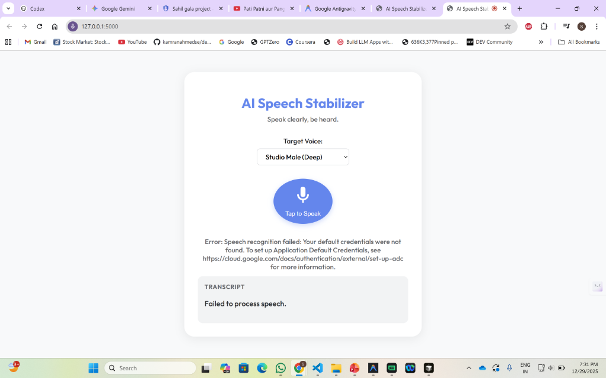

# AI Speech Stabilizer

An AI-powered web application designed to assist individuals with Parkinson’s disease by stabilizing and amplifying their speech in real-time.



## Features
-   **Voice Stabilization**: Converts soft or slurred speech into clear, authoritative audio.
-   **Customizable Voices**: Choose from various high-quality Google Cloud "Studio" voices/accents.
-   **Modern UI**: Accessible, high-contrast, dark-mode design with glassmorphism aesthetics.
-   **Visual Feedback**: Real-time transcript display.

## Technologies Used
-   **Frontend**: HTML5, CSS3, JavaScript (Vanilla)
-   **Backend**: Python, Flask
-   **AI Services**:
    -   **Google Cloud Speech-to-Text**: For accurate transcription of imperfect speech.
    -   **Google Cloud Text-to-Speech**: For generating natural-sounding audio.
-   **Deployment**: Docker support included for Google Cloud Run.

## Setup & Installation

### Prerequisites
-   Python 3.8+
-   Google Cloud Platform Account with `Speech-to-Text` and `Text-to-Speech` APIs enabled.
-   A `credentials.json` file from a Google Cloud Service Account.

### Installation
1.  Clone the repository:
    ```bash
    git clone https://github.com/sahilgala1234/Parkinson-speech-stabilizer.git
    cd Parkinson-speech-stabilizer
    ```

2.  Install dependencies:
    ```bash
    pip install -r requirements.txt
    ```

3.  **Important**: Place your Google Cloud service account key as `credentials.json` in the root directory.

4.  Run the application:
    ```bash
    python app.py
    ```

5.  Open your browser at `http://127.0.0.1:5000`.

## Deployment
This project includes a `Dockerfile` for easy deployment to Google Cloud Run.
See `deployment.md` for details.

## License
MIT
